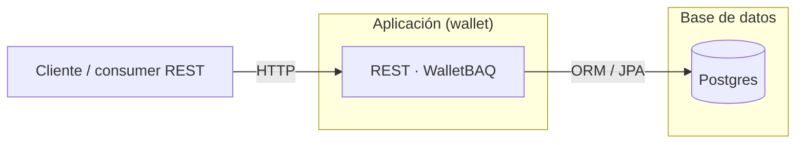
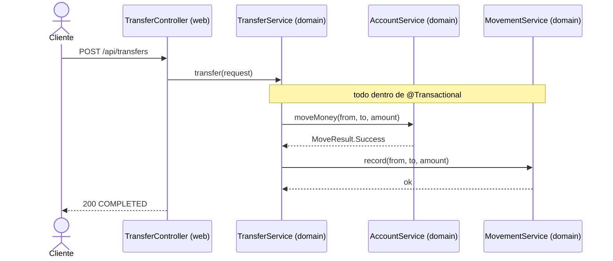
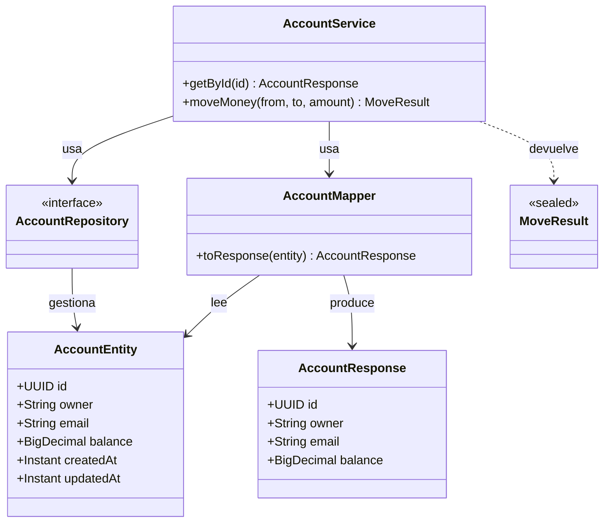
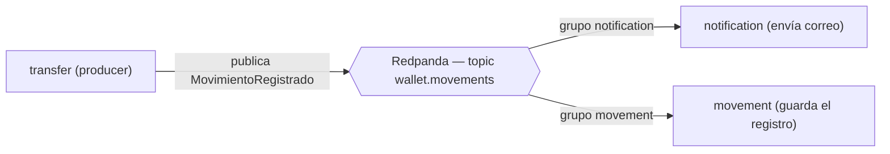
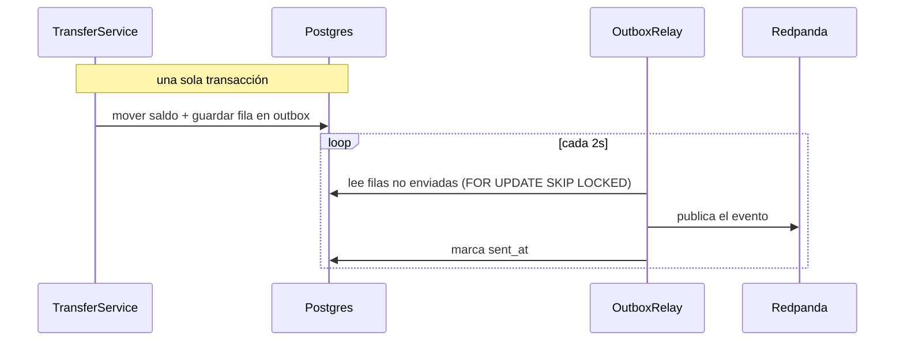
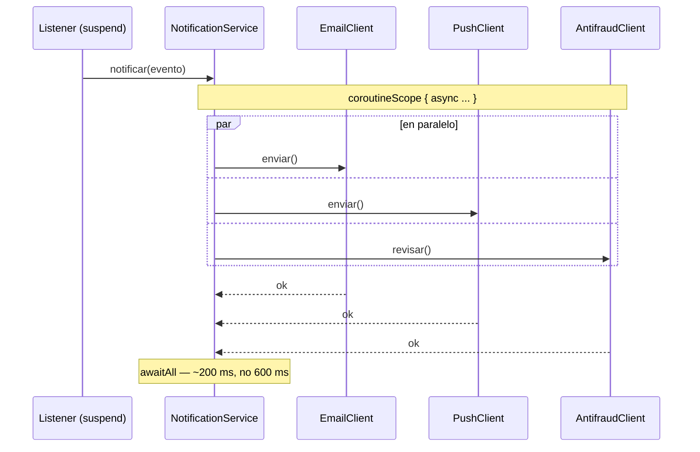

# Diagramas del taller (código Mermaid para Excalidraw)

Excalidraw importa Mermaid **nativo** solo para tres tipos: `flowchart`, `sequenceDiagram` y `classDiagram`. Cualquier otro tipo lo mete como imagen plana (no editable). Por eso este set usa solo esos tres, y a propósito **varía el tipo** para que los diagramas no se vean todos iguales.

**Cómo usarlos:** entra a [excalidraw.com](https://excalidraw.com/) → menú (☰) → **Mermaid to Excalidraw** → pega el bloque → *Insert* → estiliza y exporta como PNG.

!!! tip "Evita el glitch del `\n`"
    En el diagrama viejo, algunas cajas mostraban un `\n` literal. Eso pasa cuando el texto trae saltos de línea que Excalidraw no interpreta. Acá dejé todas las etiquetas en una sola línea a propósito. Si necesitas partir una etiqueta, hazlo en Excalidraw después de importar, no en el Mermaid.

---

## 1. Arquitectura general — *flowchart* (Fase 0 / inicio)

Reemplazo editable del diagrama "cliente → app → base".

---

## 2. Flujo de una transferencia — *sequence* (Fase 3 y 4)

Muestra el orden temporal y que todo pasa dentro de una transacción. (Tipo distinto: diagrama de secuencia.)

---

## 3. Modelo por feature (account) — *class* (Fase 2 y 3)

Las clases clave y cómo se relacionan: entidad vs DTO, el mapper, el servicio concreto, el repositorio como interfaz. (Tipo distinto: diagrama de clases.)

---

## 4. Pub/Sub de eventos — *flowchart* (Fase 5 y 7)

Un evento, dos grupos de consumidores. Cada grupo recibe su copia.

---

## 5. Patrón outbox — *sequence* (Fase 8)

El evento y el dato se guardan juntos en una transacción; un relay aparte publica. (Secuencia con `loop`.)

---

## 6. Coroutines: llamadas en paralelo — *sequence* (Fase 9)

El consumidor llama a tres servicios externos a la vez con `async`/`awaitAll`. (Secuencia con bloque `par`.)

