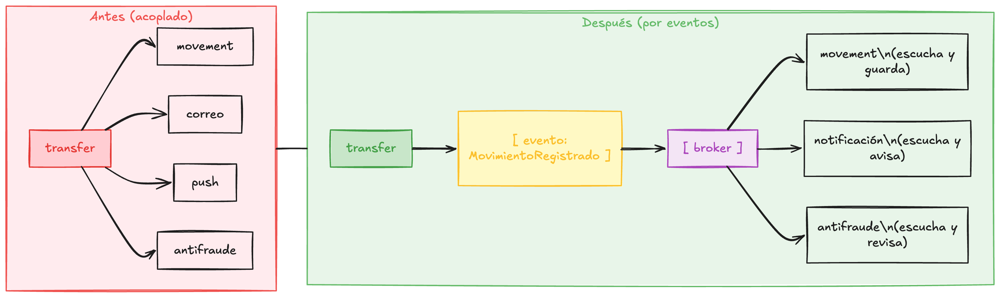

# Fase 5 · Por qué eventos

**Rama**: no hay código nuevo en esta fase, es la que te da el mapa mental. Si vas a saltar directo a la parte de eventos, arranca leyendo esta.

**Lo que vas a lograr**: entender qué problema resuelve la mensajería por eventos y el vocabulario mínimo (broker, topic, producer, consumer, grupo, offset) antes de escribir una línea.

---

## El problema, otra vez, pero en serio

En la Fase 4 dejamos esta costura en `transfer`:

```kotlin
if (result is MoveResult.Success) {
    movementService.record(request.fromId, request.toId, request.amount) // llamada directa
}
```

Funciona. El problema aparece cuando el negocio crece. A una transferencia real, con el tiempo, le cuelgan cosas: registra el movimiento, manda un correo, dispara una notificación push, avisa a antifraude, refresca un tablero de métricas. Si todo eso sale de este `if`, pasan tres cosas feas:

- `transfer` termina **conociendo** a media empresa. Cada cosa nueva es un import y una llamada más acá adentro.
- Si el servicio de correo está lento, la transferencia queda lenta. Si se cae, la transferencia se cae con él. Uno arrastra al otro.
- Agregar un consumidor nuevo obliga a **tocar y volver a desplegar** `transfer`, aunque `transfer` no cambió en nada su lógica.

La mensajería por eventos corta ese nudo. En vez de que `transfer` llame a cada interesado, publica un hecho, "se registró un movimiento", y se desentiende. Los interesados escuchan por su cuenta.



El diagrama, antes y después:

- **Antes (acoplado):** `transfer` llama directo a `movement`, al correo, al push y a antifraude. Son cuatro llamadas en línea; cada interesado nuevo es otra llamada más adentro de `transfer`, y si una se pone lenta o falla, arrastra a la transferencia.
- **Después (por eventos):** `transfer` publica **un solo** evento, `MovimientoRegistrado`, en el broker y se desentiende. `movement`, `notification` y antifraude lo escuchan cada uno por su cuenta. Sumar un consumidor nuevo **no toca** `transfer`.

Lo que cambió no es cuántas flechas hay, sino **de quién dependen**: en el "antes" todas salen de `transfer`; en el "después", `transfer` solo le habla al broker y deja de conocer a sus consumidores.

`transfer` ya no sabe quién escucha ni cuántos. Publica y sigue. Ese es todo el truco, y cambia cómo crece el sistema.

## El vocabulario mínimo

!!! abstract "Concepto al paso: evento"
    Un evento es un hecho que ya ocurrió, contado en pasado: "se registró un movimiento", "se creó una cuenta". No es una orden ("registra este movimiento"), es una notificación de algo que pasó. Quien lo emite no espera respuesta ni sabe quién lo va a usar.

!!! abstract "Concepto al paso: broker"
    El broker es el intermediario por donde pasan los eventos. El productor le entrega el evento al broker, y el broker se lo guarda y se lo entrega a quien esté suscrito. Kafka es el broker más conocido. Nosotros usamos **Redpanda**, que habla el mismo protocolo de Kafka pero es más liviano y no necesita Zookeeper.

!!! abstract "Concepto al paso: topic"
    Un topic es un canal con nombre dentro del broker, como una lista de eventos del mismo tipo. Nosotros vamos a publicar en un topic llamado `wallet.movements`. Los productores publican en un topic; los consumidores se suscriben a un topic.

!!! abstract "Concepto al paso: producer y consumer"
    El **producer** (productor) publica eventos en un topic. En nuestro caso, `transfer` va a ser el productor. El **consumer** (consumidor) se suscribe a un topic y procesa lo que llega. `notification` y `movement` van a ser consumidores del mismo topic.

!!! abstract "Concepto al paso: consumer group y por qué importa"
    Cada consumidor pertenece a un **grupo**. La regla clave: un evento se entrega **una vez por grupo**. Si `notification` y `movement` están en grupos distintos, los dos reciben cada evento y cada uno hace lo suyo. Si pones diez instancias de `notification` en el **mismo** grupo, el broker reparte los eventos entre ellas para escalar, sin duplicar el trabajo. Grupos distintos = todos se enteran; mismo grupo = se reparten la carga.

!!! abstract "Concepto al paso: offset"
    El broker no borra el evento cuando lo entrega: lo guarda en orden y le pone un número, el **offset**. Cada grupo lleva su propia marca de "voy por acá". Por eso un consumidor que se cae y vuelve retoma donde quedó, y por eso puedes meter un consumidor nuevo que lea desde el principio. El evento vive en el log, no se consume y desaparece.

## Lo que NO resuelve la magia

Los eventos desacoplan, pero traen sus propias preguntas. ¿Qué pasa si el consumidor procesa el mismo evento dos veces? ¿Qué pasa si guardaste el movimiento en la base pero el broker se cayó justo antes de publicar? Esas son idempotencia y el patrón outbox, y las vemos de cerca en la [Fase 8](fase-08-que-sigue.md). Por ahora quédate con el mapa: productor, topic, broker, consumidores en grupos, offsets.

## Cierre de la fase

No hay commit acá, es teoría. En la [Fase 6](fase-06-publicar-evento.md) montamos Redpanda y hacemos que `transfer` publique el evento en vez de llamar a `movement` directo.
