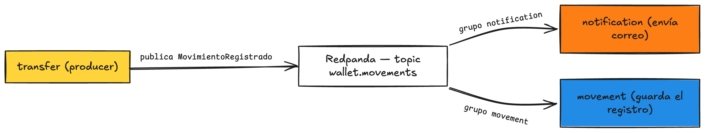

# Fase 7 · Consumir el evento

**Rama**: `fase-7` = `main`
**Lo que vas a lograr**: consumir el evento `MovimientoRegistrado` desde dos lados a la vez. `notification` avisa, `movement` guarda, cada uno en su propio grupo, sin que `transfer` sepa que existen. Acá se ve, en vivo, por qué los eventos valen la pena.

---

## Parte 1 — Configurar el consumidor

Súmale al `application.yaml` el lado consumidor. El productor mandaba JSON; el consumidor lo reconstruye.

```yaml title="src/main/resources/application.yaml (consumer)"
spring:
  kafka:
    consumer:
      key-deserializer: org.apache.kafka.common.serialization.StringDeserializer
      value-deserializer: org.springframework.kafka.support.serializer.JsonDeserializer
      auto-offset-reset: earliest
      properties:
        spring.json.trusted.packages: "com.baqjug.wallet.*"
```

!!! abstract "Concepto al paso: `trusted.packages` y por qué existe"
    Deserializar JSON a un objeto Kotlin significa crear una clase a partir de datos que llegaron de afuera. Eso, sin control, es un riesgo de seguridad. `trusted.packages` es una lista blanca: solo se permite reconstruir clases de esos paquetes. Le decimos que confíe en las nuestras (`com.baqjug.wallet.*`).

!!! abstract "Concepto al paso: `auto-offset-reset=earliest`"
    Cuando un grupo llega por primera vez a un topic y no tiene una marca previa (offset), ¿desde dónde lee? Con `earliest`, desde el principio del log. Con `latest`, solo lo nuevo. En el taller usamos `earliest` para que un consumidor que enciendes después alcance a ver los eventos que ya publicaste.

## Parte 2 — Levantar Mailpit y configurar el correo

`notification` va a **mandar un correo de verdad** cuando llegue un movimiento. Pero mandar correos reales en un taller es mala idea (spam, credenciales, rebotes). La solución: **Mailpit**, un servidor de correo falso que atrapa todo lo que la app manda y te lo muestra en el navegador.

!!! abstract "Concepto al paso: SMTP y Mailpit"
    **SMTP** es el protocolo con el que las apps entregan correos a un servidor de correo. **Mailpit** es un servidor SMTP **falso**: tu app le entrega los correos como si fuera uno real, pero en vez de mandarlos a internet, Mailpit los **atrapa** y te los muestra en una página web. Ves el correo salir, sin que le llegue a nadie.

Levántalo con Docker (un solo comando):

```bash
docker run -d --name mailpit -p 1025:1025 -p 8025:8025 axllent/mailpit
```

El puerto `1025` es el SMTP (por ahí le entrega tu app); el `8025` es la UI web, en `http://localhost:8025`, donde ves los correos.

Agrega la dependencia de correo de Spring:

```kotlin title="build.gradle.kts (dependencies)"
implementation("org.springframework.boot:spring-boot-starter-mail")
```

Y la configuración del correo, con valores por variable de entorno para poder cambiarlos en producción sin tocar el código:

```yaml title="src/main/resources/application.yaml (correo)"
spring:
  mail:
    host: ${SMTP_HOST:localhost}
    port: ${SMTP_PORT:1025}
    username: ${SMTP_USER:}
    password: ${SMTP_PASSWORD:}
    properties:
      mail.smtp.auth: false
      mail.smtp.starttls.enable: false
```

!!! note "Los `:` con valor por defecto"
    `${SMTP_HOST:localhost}` significa "usa la variable `SMTP_HOST`, y si no existe, `localhost`". Así en tu máquina apunta solo a Mailpit sin configurar nada, y en la nube (Fase 10) le pones las variables de un proveedor real.

## Parte 3 — El consumidor que notifica (por correo)

Primera feature nueva: `notification`. Escucha el evento y le manda un correo al dueño de la cuenta que **recibió** la plata. Para eso necesita su email, y se lo pide a la feature `account` con el `AccountService` que ya tienes.

```kotlin title="notification/domain/EmailNotifier.kt"
package com.baqjug.wallet.notification.domain

import com.baqjug.wallet.account.domain.AccountService
import com.baqjug.wallet.movement.domain.MovimientoRegistrado
import org.springframework.mail.SimpleMailMessage
import org.springframework.mail.javamail.JavaMailSender
import org.springframework.stereotype.Component

@Component
class EmailNotifier(
    private val accountService: AccountService,
    private val mailSender: JavaMailSender
) {
    fun notificar(evento: MovimientoRegistrado) {
        val destino = accountService.getById(evento.toId)   // la cuenta destino, con su email
        val mensaje = SimpleMailMessage().apply {
            from = "wallet@baqjug.com"
            setTo(destino.email)
            subject = "Recibiste un movimiento en tu wallet"
            text = "Hola ${destino.owner}, recibiste ${evento.amount} en tu cuenta."
        }
        mailSender.send(mensaje)
    }
}
```

!!! abstract "Spring al paso: `JavaMailSender`"
    `JavaMailSender` es la herramienta de Spring para mandar correos. La autoconfigura Boot con las propiedades `spring.mail.*` que pusiste; tú solo la inyectas. `SimpleMailMessage` es un correo de texto plano: remitente, destinatario, asunto y cuerpo. Para HTML o adjuntos usarías `MimeMessage`, pero para un aviso nos sobra con esto.

!!! note "`notification` lee de `account`, y está bien"
    Para saber a qué correo escribir, `notification` le pide la cuenta a `AccountService`. Eso es una lectura entre features, y no rompe el desacople: lo que nos importaba era que **`transfer` no conociera a sus consumidores**. Que un consumidor consulte datos de otra feature es normal y esperable.

Y el listener, que solo recibe el evento y delega:

```kotlin title="notification/messaging/MovimientoNotificationListener.kt"
package com.baqjug.wallet.notification.messaging

import com.baqjug.wallet.movement.domain.MovimientoRegistrado
import com.baqjug.wallet.notification.domain.EmailNotifier
import org.springframework.kafka.annotation.KafkaListener
import org.springframework.stereotype.Component

@Component
class MovimientoNotificationListener(
    private val emailNotifier: EmailNotifier
) {

    @KafkaListener(topics = ["wallet.movements"], groupId = "notification")
    fun onMovimiento(evento: MovimientoRegistrado) {
        emailNotifier.notificar(evento)
    }
}
```

!!! abstract "Spring al paso: `@KafkaListener`"
    `@KafkaListener` convierte un método en consumidor. `topics` dice qué escuchar, `groupId` a qué grupo pertenece. Spring se suscribe al arrancar, y cada vez que llega un evento, llama tu método con el objeto ya deserializado. Tú solo escribes qué hacer con él.

## Parte 4 — El consumidor que guarda

Acá está lo interesante. En la Fase 4, `movement` guardaba porque `transfer` lo llamaba. Ahora `movement` guarda porque **escucha el evento**, en su propio grupo. Reusa el `MovementService` que ya tenías.

```kotlin title="movement/messaging/MovimientoPersistenceListener.kt"
package com.baqjug.wallet.movement.messaging

import com.baqjug.wallet.movement.domain.MovementService
import com.baqjug.wallet.movement.domain.MovimientoRegistrado
import org.springframework.kafka.annotation.KafkaListener
import org.springframework.stereotype.Component

@Component
class MovimientoPersistenceListener(
    private val movementService: MovementService
) {

    @KafkaListener(topics = ["wallet.movements"], groupId = "movement")
    fun onMovimiento(evento: MovimientoRegistrado) {
        movementService.record(evento.fromId, evento.toId, evento.amount)
    }
}
```

!!! danger "Grupos distintos: los dos reciben cada evento"
    Fíjate: `notification` está en el grupo `notification` y `movement` en el grupo `movement`. Como son grupos distintos, **cada uno recibe una copia** de cada evento. Una sola transferencia dispara un aviso y un registro, en paralelo, sin que se pisen. Si ambos estuvieran en el mismo grupo, el broker le daría el evento a uno solo. Esa diferencia es el corazón del pub/sub.



!!! note "Un consumidor nuevo no toca a `transfer`"
    Este es el pago de todo el trabajo. Agregaste dos consumidores y no tocaste una línea de `transfer`. Mañana quieres antifraude: creas otro `@KafkaListener` con su grupo y listo. `transfer` ni se entera. Compara eso con la rama `Success` de la Fase 4, donde cada cosa nueva era editar y redesplegar `transfer`.

## Parte 5 — Verlo funcionar

Con Mailpit corriendo, arranca la app y haz una transferencia:

```bash
curl -X POST http://localhost:8080/api/transfers \
  -H "Content-Type: application/json" \
  -d '{
        "fromId": "11111111-1111-1111-1111-111111111111",
        "toId": "22222222-2222-2222-2222-222222222222",
        "amount": 15000.00
      }'
```

Ahora abre **`http://localhost:8025`**: ahí está el correo que mandó `notification`, atrapado por Mailpit, dirigido a `geovanny@example.com` (el dueño de la cuenta destino). Y en Supabase, la tabla `movements` tiene una fila nueva, guardada por el listener de `movement`. Un evento, dos consumidores, cero acople con `transfer`.

!!! warning "Ojo con procesar el mismo evento dos veces"
    Si el broker reentrega un evento (pasa: reinicios, rebalanceos), el listener de `movement` podría guardar el movimiento dos veces. Hoy no lo evitamos. Cómo hacer que consumir el mismo evento varias veces no rompa nada, eso es idempotencia, y lo vemos en la [Fase 8](fase-08-que-sigue.md).

## Cierre de la fase

```bash
./gradlew test
git add .
git commit -m "fase-7: notification y movement consumen el evento en grupos separados"
git branch fase-7
git checkout -b main
```

Esta es la versión completa. Tienes una wallet que transfiere validando saldo, publica un hecho cuando algo pasa, y tiene consumidores independientes que reaccionan sin conocerse entre sí.

En la [Fase 8](fase-08-que-sigue.md) cierro con lo que falta para que esto aguante producción: idempotencia, el patrón outbox, colas de mensajes muertos, y separar de verdad los servicios.
