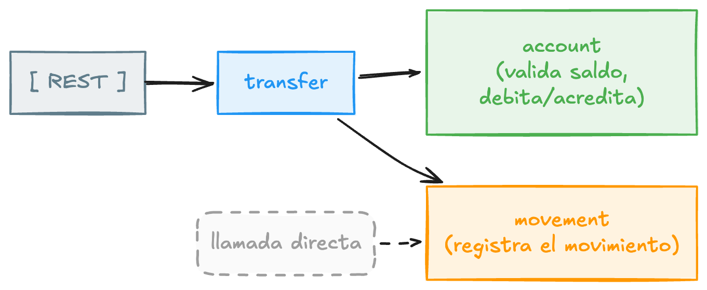

# Una wallet en Kotlin, de un endpoint REST a eventos

Esta guía construye desde cero una billetera digital en Kotlin y Spring Boot. Empezamos con un endpoint REST que mueve plata entre dos cuentas contra una base Postgres, y terminamos con ese mismo movimiento viajando como un evento que otro servicio consume. Se puede seguir sola, de principio a fin.

Si nunca tocaste Kotlin, tranquilo: vamos explicando cada cosa del lenguaje la primera vez que aparece. Si vienes de Kotlin pero nunca hiciste Spring, igual: cada anotación y cada pieza de infraestructura se explica cuando entra en juego. No asumo que porque lees una cosa ya sabes la otra.

!!! note "Esto no es un 'hola mundo'"
    Aunque explicamos todo desde la base, lo que construimos tiene sustancia: dinero con `BigDecimal`, una transferencia transaccional que no puede dejar saldos rotos, y un desacople real por mensajería. Los conceptos difíciles no se esconden, se explican.

## Qué vamos a construir

Una wallet, **`wallet`**, con tres cosas que hace cualquier billetera:

- Consultar el saldo de una cuenta.
- Transferir plata de una cuenta a otra, validando que haya saldo.
- Dejar registrado cada movimiento.

A vista de pájaro, la wallet es esto: unos clientes entran por HTTP a una aplicación REST, y esa aplicación lee y escribe en una base de datos Postgres. Nada más. Toda la magia de las siguientes fases pasa dentro de esa caja del medio.

Esa caja del medio, la aplicación, es donde vive todo lo que vamos a escribir. Y adentro, el registro de cada movimiento arranca de la forma más simple posible: una llamada directa dentro del mismo proceso.

En la parte de eventos, el registro deja de ser una llamada directa y pasa a publicarse:

El cambio se ve chico en el diagrama, pero es el corazón de la segunda parte: `transfer` deja de saber quién registra o notifica. Solo suelta un evento. Quién lo escuche, y cuántos lo escuchen, ya no es su problema.

## El problema que motiva la parte de eventos

Imagina que a la wallet le empiezan a pedir cosas cada vez que ocurre una transferencia: registra el movimiento, manda un correo, dispara una notificación push, avisa a antifraude, actualiza un tablero. Si todo eso lo llama `transfer` de forma directa, ese método se vuelve un monstruo que conoce a media empresa. Y si el servicio de correo se cae, la transferencia se cae con él.

La mensajería por eventos corta ese nudo. `transfer` publica un hecho, "esto pasó", y sigue con su vida. Los interesados escuchan por su cuenta. Se caen y se levantan sin arrastrar a la transferencia. Eso es lo que vas a construir con tus manos en la Fase 6 y 7.

## Cómo está organizada

Cada fase es una etapa y, en el repo, una rama. Puedes hacer `git checkout` a cualquiera para seguir desde ahí si te atrasas.

| Fase | Rama | Qué construye |
|------|------|----------------|
| 0 | `fase-0` | El problema, el andamiaje y Supabase |
| 1 | `fase-1` | El dominio: cuenta, saldo, JPA y Flyway |
| 2 | `fase-2` | Exponer el saldo por REST |
| 3 | `fase-3` | Transferencia con validación de saldo |
| 4 | `fase-4` | Registro de movimientos (llamada directa) |
| 5 | `fase-5` | Por qué eventos: broker, topic, producer, consumer |
| 6 | `fase-6` | Publicar el evento con Redpanda |
| 7 | `fase-7` = `main` | Consumir el evento desde otro servicio |
| 8 | (referencia) | Qué sigue: outbox, idempotencia, DLQ |

!!! tip "Puedes entrar por cualquier fase"
    Cada rama deja el proyecto justo en el estado de esa fase. Si te perdiste en un paso, `git checkout fase-2` y sigues desde ahí sin quedarte atrás. Y si lo que te interesa es directamente la parte de eventos, `git checkout fase-4` te pone en la línea de salida con toda la base REST ya lista. La rama `main` es la versión final con eventos.

## Versiones

Kotlin 2.3 · Spring Boot 4.1 · JDK 25 · Spring Data JPA · Flyway · Spring for Apache Kafka · Supabase (PostgreSQL 17) · Redpanda.

!!! note "Confirma versiones en el asistente"
    En [start.spring.io](https://start.spring.io) las versiones cambian con el tiempo. Si no ves Spring Boot 4.1, elige la 4.x estable más cercana. El asistente se encarga de que las dependencias sean compatibles entre sí.

Cuando estés listo, revisa [Requisitos y setup](requisitos.md) y arranca por la [Fase 0](fase-00-arranque.md).
