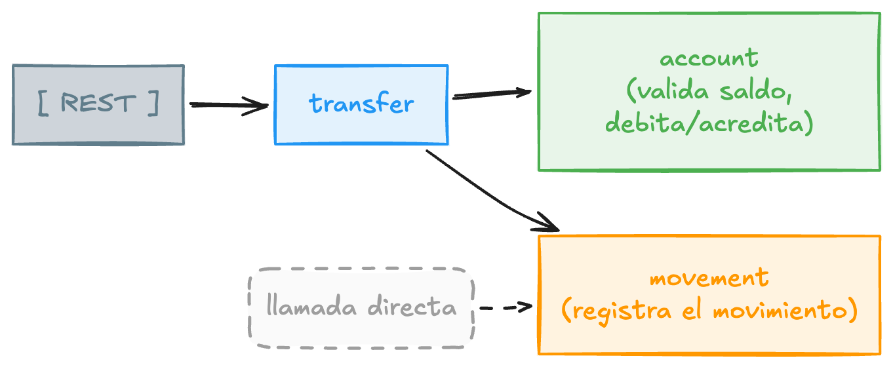
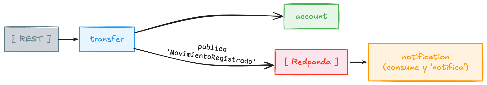

# Una wallet en Kotlin, de un endpoint REST a eventos

Esta guía construye desde cero una billetera digital en Kotlin y Spring Boot. El problema es engañosamente simple: mover plata de una cuenta a otra **sin perder ni duplicar un peso**, validando que haya saldo y dejando registro de cada movimiento. Suena trivial; no lo es. Lo resolvemos primero con un endpoint REST directo contra Postgres —esa es la base, y es donde ponemos el grueso del trabajo— y más adelante ese mismo movimiento viaja como un evento que otros servicios consumen. Se puede seguir sola, de principio a fin.

Si nunca tocaste Kotlin, tranquilo: vamos explicando cada cosa del lenguaje la primera vez que aparece. Si vienes de Kotlin pero nunca hiciste Spring, igual: cada anotación y cada pieza de infraestructura se explica cuando entra en juego. No asumo que porque lees una cosa ya sabes la otra.

!!! note "Esto no es un 'hola mundo'"
    Aunque explicamos todo desde la base, lo que construimos tiene sustancia: dinero con `BigDecimal`, una transferencia transaccional que no puede dejar saldos rotos, y una arquitectura limpia organizada por features. Los conceptos difíciles no se esconden, se explican.

## El problema

Una billetera tiene que hacer tres cosas, y las tres bien:

- **Consultar el saldo** de una cuenta.
- **Transferir plata** de una cuenta a otra, rechazando la operación si no hay fondos.
- **Registrar cada movimiento**, para que nada quede sin rastro.

Lo delicado no es el "qué", es el "cómo". Una transferencia no puede quedar a medias —la cuenta de origen debitada y la de destino sin acreditar—, y el dinero no admite errores de redondeo. Todo lo que construimos de la Fase 0 a la 4 gira alrededor de resolver eso bien: una wallet que mueve plata de verdad, por REST, contra una base real.

A vista de pájaro es simple: unos clientes entran por HTTP a una aplicación, y esa aplicación lee y escribe en una base Postgres. La forma completa la ves en la [Fase 0](fase-00-arranque.md).

El diagrama, paso a paso:

1. **Cliente → `transfer` (HTTP):** llega un `POST` con origen, destino y monto.
2. **`transfer` valida y mueve en `account`:** comprueba que haya saldo, debita la cuenta de origen y acredita la de destino.
3. **`transfer` → `movement` (llamada directa):** en la misma operación, deja registrado el movimiento.

Todo ocurre dentro del mismo proceso y de una sola transacción: si algo falla, no queda nada a medias. La contra —que pagaremos más adelante— es que `transfer` conoce a todos, y cada cosa nueva que cuelgue de una transferencia lo obliga a cambiar.

## Por qué este stack (y no otro)

Cada pieza responde a un requisito del problema, no a la moda:

- **Kotlin** — expresivo y seguro: `data class` para objetos de datos en una línea, null-safety para que los nulos no exploten en tiempo de ejecución, y `sealed class` para modelar con exactitud los desenlaces de una operación. Menos código que Java para lo mismo.
- **Spring Boot** — servidor web, acceso a datos e inyección de dependencias sin configurar medio mundo. Te concentras en la lógica; Boot cablea lo aburrido.
- **PostgreSQL (Supabase)** — una base **relacional con transacciones ACID**, porque una transferencia es todo-o-nada. ¿Por qué no una NoSQL? Porque acá el corazón es la **consistencia sobre dinero**: una relacional te la da de frente, mientras que en una documental tendrías que inventar la transaccionalidad a mano.
- **`BigDecimal` con `NUMERIC`** — dinero exacto. Nada de `Double`, que redondea mal y en un saldo eso es un desastre.
- **Flyway** — el esquema de la base versionado en el repo, reproducible en cualquier máquina.

El "por qué" completo, requisito por requisito, está en la [Fase 0](fase-00-arranque.md).

## Y más adelante: desacoplar con eventos

Cuando la wallet crece, a cada transferencia le empiezan a colgar cosas: manda un correo, dispara un push, avisa a antifraude, refresca métricas. Hacerlo todo con llamadas directas termina en un `transfer` que conoce a media empresa y que se cae si se cae el correo. La mensajería por eventos corta ese nudo: `transfer` publica un hecho, "se registró un movimiento", y se desentiende; cada interesado reacciona por su cuenta.

El diagrama, paso a paso:

1. **`transfer` mueve el saldo en `account`**, igual que antes.
2. **`transfer` publica el evento** `MovimientoRegistrado` en Redpanda y se desentiende: no sabe —ni le importa— quién lo va a escuchar.
3. **`notification` consume el evento** por su cuenta y avisa. Mañana, otro interesado (push, antifraude) se suscribe y reacciona **sin tocar `transfer`**.

El cambio de fondo: `transfer` dejó de llamar a nadie; ahora solo anuncia lo que pasó. Ahí está el desacople.

Eso —y cómo endurecerlo para producción, las coroutines y el despliegue— lo construyes **de la Fase 5 en adelante**. Si por ahora vienes por la parte REST, con las Fases 0 a 4 ya tienes una wallet completa y redonda.

## Cómo está organizada

Cada fase es una etapa y, en el repo, una rama. Puedes hacer `git checkout` a cualquiera para seguir desde ahí si te atrasas.

| Fase | Rama | Qué construye |
|------|------|----------------|
| 0 | `fase-0` | El problema, el andamiaje y Supabase |
| 1 | `fase-1` | El dominio: cuenta, saldo, JPA y Flyway |
| 2 | `fase-2` | Exponer el saldo por REST |
| 3 | `fase-3` | Transferencia con validación de saldo |
| 4 | `fase-4` | Registro de movimientos (llamada directa) |
| 5 | `fase-5` | Por qué eventos: broker, topic, producer, consumer |
| 6 | `fase-6` | Publicar el evento con Redpanda |
| 7 | `fase-7` = `main` | Consumir el evento desde otro servicio |
| 8 | (referencia) | De demo a producción: outbox, idempotencia, DLQ |
| 9 | (opcional) | Coroutines: un consumidor no bloqueante |
| 10 | (despliegue) | Docker, GitHub Actions y deploy a la nube |

!!! tip "Puedes entrar por cualquier fase"
    Cada rama deja el proyecto justo en el estado de esa fase. Si te perdiste en un paso, `git checkout fase-2` y sigues desde ahí sin quedarte atrás. Y si lo que te interesa es directamente la parte de eventos, `git checkout fase-4` te pone en la línea de salida con toda la base REST ya lista. La rama `main` es la versión final con eventos.

## Versiones

Kotlin 2.3 · Spring Boot 4.1 · JDK 25 · Spring Data JPA · Flyway · Spring for Apache Kafka · Supabase (PostgreSQL 17) · Redpanda · Docker · GitHub Actions.

!!! note "Confirma versiones en el asistente"
    En [start.spring.io](https://start.spring.io) las versiones cambian con el tiempo. Si no ves Spring Boot 4.1, elige la 4.x estable más cercana. El asistente se encarga de que las dependencias sean compatibles entre sí.

Cuando estés listo, revisa [Requisitos y setup](requisitos.md) y arranca por la [Fase 0](fase-00-arranque.md).
